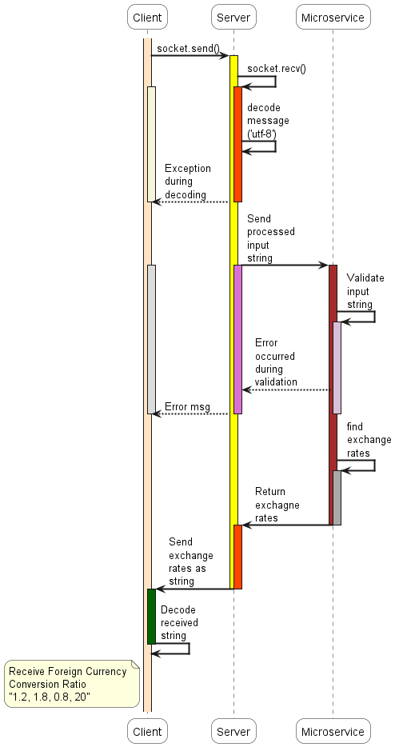

# Microservice: Foreign Currency Conversion Ratio

### Author: Seokwon Kim
### Class: CS361

Add a README to your GitHub (or update it if you already have one) that contains your communication contract. (Once you define it, don't change it! Your partner is relying on you.) README must contain...

    Clear instructions for how to REQUEST data from the microservice you implemented. Include an example call.
    Clear instructions for how to RECEIVE data from the microservice you implemented
    UML sequence diagram showing how requesting and receiving data work. Make it detailed enough that your partner (and your grader) will understand

## How to Request Data from Microservice
1. Initialize a zmq context
2. Initialize a socket
3. Connect to zmq server via port 5555
4. Send a request string via socket
```
        context = zmq.Context()
        socket = context.socket(zmq.REQ)
        socket.connect("tcp://localhost:5555")

        # send a message
        data = "USD to EUR, USD to GBP, USD to CAD, USD to JPY"
        socket.send_string(data)
```
## How to Receive Data from Microservice
5. Once the request data string is sent from the STEP 4, a response is received \
via socket.recv()
```
        socket.recv()
```

## UML Diagram

